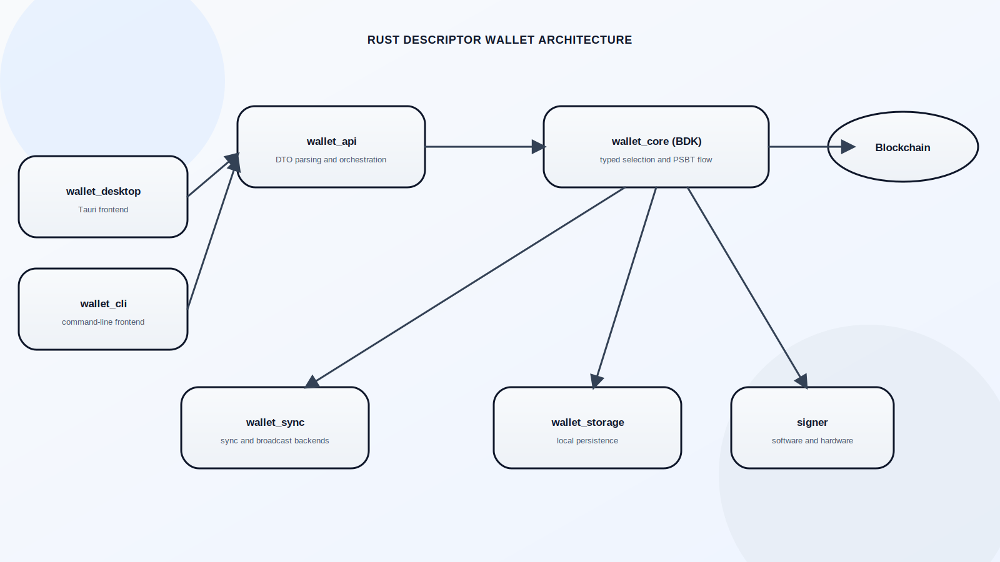
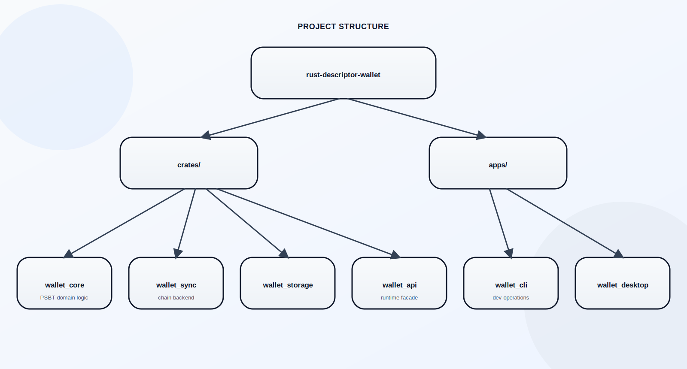
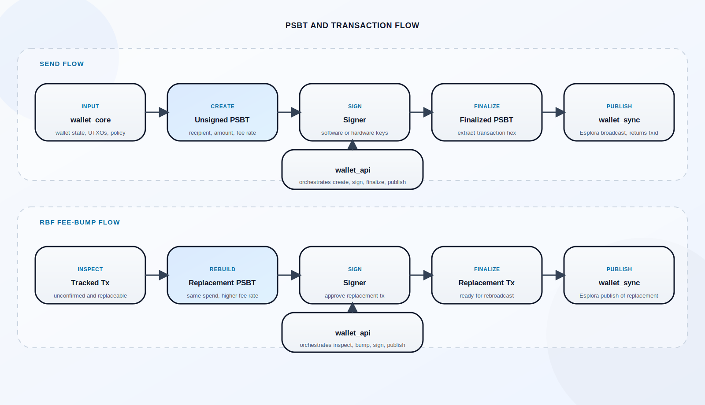

# Rust Descriptor Wallet


A modular Bitcoin descriptor wallet in Rust, designed around clean crate boundaries, BDK-based wallet logic, and a path toward a desktop wallet with a clear separation between core logic, chain integration, storage, API, and UI.

This repository is being built as a production-style architecture project: the design is already laid out, the workspace is in place, and the missing wallet functionality is actively being filled in.

Current milestone: the project now supports real wallet transaction operations across coin control, send-max, sweep, consolidation, RBF, and CPFP, with explicit input-selection modes and full local regtest integration coverage.

## Vision

The goal is to build a descriptor-first Bitcoin wallet that demonstrates:

- clean Rust workspace architecture
- explicit separation of wallet logic, chain integration, storage, and presentation
- a practical PSBT-oriented transaction flow
- a codebase that can evolve from CLI-first development into a desktop application

## Architecture



### Components

- `wallet_core (BDK)`: descriptor handling, wallet state, address derivation, transaction construction, and PSBT flow
- `wallet_sync`: chain integration layer for Esplora, Electrum, and Bitcoin Core RPC backends
- `wallet_storage`: local persistence layer
- `wallet_api`: orchestration boundary shared by apps
- `test_support`: local regtest helpers for integration tests and scripted environment control
- `wallet_cli`: command-line entry point
- `wallet_desktop`: desktop app entry point

## Project Structure



## Current Progress

### Implemented

- Rust workspace with separate crates and app entry points
- `wallet_cli`, `wallet_desktop`, `wallet_api`, `wallet_core`, `wallet_sync`, `wallet_storage`, and `test_support` crates wired into the workspace
- architecture and project-structure documentation
- SQLite-backed wallet registry in `wallet_storage`
- automatic storage initialization and migration on API startup
- wallet import, listing, lookup, and deletion through `wallet_api`
- CLI commands for wallet metadata management
- runtime wallet loading and creation backed by per-wallet BDK file stores
- receive-address generation for stored wallets
- backend-aware wallet sync through `wallet_sync`
- Electrum sync support for local and compatible deployments
- balance queries over persisted wallet state
- wallet status reporting with balance, UTXO count, and latest observed block height
- transaction history inspection from synced wallet state
- UTXO inspection from synced wallet state
- unsigned PSBT creation through the runtime wallet flow
- PSBT signing for software-signing wallets
- finalized-PSBT extraction and publish through `wallet_sync`
- Bitcoin Core RPC broadcast backend for local/regtest transaction publication
- end-to-end create/sign/publish orchestration in the API layer
- coin-control transaction building with explicit include/exclude outpoints
- strict coin-control enforcement for explicitly included input sets
- explicit input-selection modes: `strict-manual`, `manual-with-auto-completion`, and `automatic-only`
- confirmed-only coin-control selection for safer manual spending
- send-max PSBT creation and one-shot send flow
- sweep PSBT creation and one-shot sweep flow
- wallet-internal consolidation PSBT creation and one-shot consolidation flow
- consolidation candidate selection by explicit include/exclude sets, confirmation state, input count, UTXO value range, fee ceiling, and strategy
- replacement PSBT creation for RBF-enabled transactions
- one-shot fee bump flow from replacement build through publish
- CPFP PSBT creation for unconfirmed parent transactions
- one-shot CPFP flow through build, sign, publish, and confirmation in integration tests
- transaction inspection now surfaces fee rate and replaceability metadata
- stronger domain types for wallet amounts, fee rates, keychains, and transaction direction
- regtest support scripts under `infra/regtest`
- reusable `test_support` helpers for local node control, mining, funding, and mempool inspection
- single-threaded local integration tests covering receive, self-send/change, send-max, sweep, consolidation, coin control, RBF replacement, and CPFP flows

### In Progress

- descriptor validation and richer domain logic inside `wallet_core`
- richer send controls and policy handling
- richer command surface in `wallet_api`
- desktop integration on top of the same runtime API

### Expected Shortly

- richer transaction policy controls around selection defaults, limits, and safety checks
- hardware-signing flow on top of the same PSBT pipeline
- first desktop flow on top of the same wallet API boundary

## Planned Capabilities

The intended feature set includes:

- descriptor wallets with `wpkh` and later `tr`
- external and internal derivation paths
- blockchain sync through Esplora and Electrum
- transaction broadcast through Esplora or Bitcoin Core RPC
- persisted wallet metadata and per-wallet database paths
- runtime address derivation and balance tracking
- UTXO tracking
- transaction history inspection
- transaction building
- unsigned PSBT creation
- manual coin control over transaction input selection
- PSBT signing flow
- finalized transaction broadcast
- one-shot send flow through create + sign + publish
- send-max flow
- sweep flow
- wallet-internal UTXO consolidation flow
- RBF fee bump flow
- CPFP child-transaction flow
- watch-only support
- hardware signer support
- desktop UI built on the same API boundary

## PSBT Flow



The intended transaction flow is:

1. wallet state and descriptors define spendable coins and change policy
2. the builder selects inputs and constructs outputs
3. a PSBT is created as the signing handoff format
4. a signer adds signatures without owning the full wallet application layer
5. the finalized transaction is broadcast to the network

Current code now covers the full software-wallet path: create PSBT, sign it, finalize it, and publish the resulting transaction through the shared chain backend, with local regtest using Electrum sync plus Bitcoin Core RPC broadcast.

For manually managed spend construction, the code also supports coin control:

1. inspect wallet UTXOs
2. explicitly include and/or exclude outpoints
3. optionally require confirmed-only selected inputs
4. when `--include` is used, treat that set as strict and reject builds that would need extra wallet inputs
5. build a PSBT or full send flow using only the allowed input set

For wallet-drain flows, the code also supports send-max and sweep:

1. inspect wallet UTXOs and decide whether to drain the whole spendable set or a selected subset
2. use `send-max` to spend all allowed wallet value to a recipient after fees
3. use `sweep` to drain an explicitly selected strict include set with no extra inputs added
4. sign and publish through the same PSBT pipeline

For wallet maintenance, the code also supports UTXO consolidation:

1. inspect wallet UTXOs and choose manual or automatic candidate selection
2. optionally include exact outpoints, exclude outpoints, require confirmed-only inputs, and set input-count or value filters
3. select an ordering strategy such as `smallest-first`, `largest-first`, or `oldest-first`
4. build a wallet-internal PSBT that spends multiple wallet UTXOs into one internal wallet output
5. sign and publish through the same PSBT pipeline

For replaceable transactions, the code also supports a fee-bump path:

1. inspect an unconfirmed RBF transaction
2. build a replacement PSBT at a higher fee rate
3. sign the replacement transaction
4. publish the replacement through the configured broadcast backend

For stuck transactions with wallet-owned unconfirmed outputs, the code also supports a CPFP path:

1. inspect an unconfirmed parent transaction
2. select an eligible wallet-owned child input from the parent outputs
3. build a CPFP PSBT at the requested fee rate
4. sign and publish the child transaction through the configured backend

## Getting Started

### Prerequisites

- Rust toolchain
- Cargo

### Build

```bash
cargo build
```

### Run the Current CLI

```bash
cargo run -p wallet_cli -- --help
```

Current output:

```text
Rust Descriptor Wallet CLI
Usage: wallet_cli <COMMAND>
```

Current wallet-management commands:

```bash
cargo run -p wallet_cli -- import-wallet --file wallet-mutiny-soft.json
cargo run -p wallet_cli -- import-wallet --file wallet-regtest-local.json
cargo run -p wallet_cli -- list-wallets
cargo run -p wallet_cli -- get-wallet mutiny-soft
cargo run -p wallet_cli -- delete-wallet mutiny-soft
cargo run -p wallet_cli -- address --name regtest-local
cargo run -p wallet_cli -- sync --name regtest-local
cargo run -p wallet_cli -- balance --name regtest-local
cargo run -p wallet_cli -- status --name regtest-local
cargo run -p wallet_cli -- txs --name regtest-local
cargo run -p wallet_cli -- utxos --name regtest-local
cargo run -p wallet_cli -- create-psbt --name regtest-local --to bcrt1... --amount 5000 --fee-rate 2
cargo run -p wallet_cli -- create-psbt-with-coin-control --name regtest-local --to bcrt1... --amount 5000 --fee-rate 2 --include <txid:vout> --exclude <txid:vout> --confirmed-only --selection-mode strict-manual
cargo run -p wallet_cli -- create-send-max-psbt --name regtest-local --to bcrt1... --fee-rate 2
cargo run -p wallet_cli -- create-send-max-psbt-with-coin-control --name regtest-local --to bcrt1... --fee-rate 2 --include <txid:vout> --exclude <txid:vout> --confirmed-only --selection-mode strict-manual
cargo run -p wallet_cli -- sweep-psbt --name regtest-local --to bcrt1... --include <txid:vout> --exclude <txid:vout> --fee-rate 2 --confirmed-only --selection-mode strict-manual
cargo run -p wallet_cli -- create-consolidation-psbt --name regtest-local --fee-rate 2 --confirmed-only --min-input-count 2 --strategy smallest-first --selection-mode automatic-only
cargo run -p wallet_cli -- create-consolidation-psbt --name regtest-local --fee-rate 2 --include <txid:vout> --include <txid:vout> --confirmed-only --selection-mode strict-manual
cargo run -p wallet_cli -- sign-psbt --name regtest-local --psbt-base64 '<base64>'
cargo run -p wallet_cli -- publish-psbt --name regtest-local --psbt-base64 '<base64>'
cargo run -p wallet_cli -- bump-fee-psbt --name regtest-local --txid <txid> --fee-rate 5
cargo run -p wallet_cli -- bump-fee --name regtest-local --txid <txid> --fee-rate 5
cargo run -p wallet_cli -- cpfp-psbt --name regtest-local --parent-txid <txid> --outpoint <txid:vout> --fee-rate 5
cargo run -p wallet_cli -- cpfp --name regtest-local --parent-txid <txid> --outpoint <txid:vout> --fee-rate 5
cargo run -p wallet_cli -- send-psbt --name regtest-local --to bcrt1... --amount 5000 --fee-rate 2
cargo run -p wallet_cli -- send-psbt-with-coin-control --name regtest-local --to bcrt1... --amount 5000 --fee-rate 2 --include <txid:vout> --exclude <txid:vout> --confirmed-only --selection-mode strict-manual
cargo run -p wallet_cli -- send-max-psbt --name regtest-local --to bcrt1... --fee-rate 2
cargo run -p wallet_cli -- send-max-psbt-with-coin-control --name regtest-local --to bcrt1... --fee-rate 2 --include <txid:vout> --exclude <txid:vout> --confirmed-only --selection-mode strict-manual
cargo run -p wallet_cli -- sweep --name regtest-local --to bcrt1... --include <txid:vout> --exclude <txid:vout> --fee-rate 2 --confirmed-only --selection-mode strict-manual
cargo run -p wallet_cli -- consolidate-psbt --name regtest-local --fee-rate 2 --confirmed-only --min-input-count 2 --strategy smallest-first --selection-mode automatic-only
```

Current note on coin control:

- `--include` explicitly locks the spend to the listed wallet outpoints
- `--exclude` marks wallet outpoints as unspendable for that build
- `--confirmed-only` rejects selected unconfirmed inputs
- without an explicit `--selection-mode`, included outpoints default to strict manual selection
- `--selection-mode strict-manual` uses only explicitly included inputs
- `--selection-mode manual-with-auto-completion` pins included inputs and allows extra eligible wallet inputs when needed
- `--selection-mode automatic-only` ignores manual includes and lets the wallet select from eligible candidates
- use `utxos` first, then `create-psbt-with-coin-control` or `send-psbt-with-coin-control`

Current note on `send-max` and `sweep`:

- `send-max` drains the full allowed spendable value to the recipient after fees
- `send-max` can be combined with coin control to drain only the allowed selected subset
- `sweep` is the strict exact-selection form of send-max and is intended for explicitly chosen outpoints
- strict sweep/send-max flows are expected to avoid wallet-added change when the selected set is drained entirely

Current note on consolidation:

- consolidation is wallet-internal maintenance, not an external payment
- it spends multiple wallet UTXOs into one wallet-owned internal output
- without explicit includes, automatic selection defaults to confirmed-only and `smallest-first`
- `--include` can force exact outpoints, while `--exclude` prevents specific wallet outpoints from being selected
- `--min-input-count`, `--max-input-count`, `--min-utxo-value-sat`, `--max-utxo-value-sat`, `--max-fee-pct`, and `--strategy` tune automatic consolidation
- `--selection-mode` decides whether consolidation is strict manual, manual plus automatic completion, or fully automatic

Current note on `cpfp-psbt`:

- use `txs` and `utxos` to choose a wallet-owned unconfirmed parent output
- pass that outpoint explicitly with `--outpoint`
- then run `cpfp-psbt`, `sign-psbt`, and `publish-psbt` for the full manual flow
- or run `cpfp` for the one-shot build, sign, and publish flow

What is stored right now:

- wallet name
- network
- external and internal descriptors
- sync backend configuration
- optional broadcast backend configuration
- watch-only flag
- derived per-wallet database path

What works at runtime now:

- load or create a persisted BDK wallet from the stored descriptors
- reveal the next external receive address and persist the derivation state
- sync wallet state through the configured backend via `wallet_sync`
- read total balance from the persisted wallet state
- inspect a high-level wallet status view
- inspect wallet transaction history from the current synced state
- inspect spendable UTXOs from the current synced state
- create an unsigned PSBT with destination, amount, fee, and selected input summary
- create PSBTs with explicit include/exclude coin-control constraints
- choose strict manual, manual-with-auto-completion, or automatic-only input selection
- create send-max PSBTs that drain the full allowed spendable balance after fees
- create sweep PSBTs that drain explicitly selected outpoints
- create wallet-internal consolidation PSBTs from manual or automatically selected UTXO sets
- sign a PSBT using wallet-owned private descriptor material
- classify signing results as unchanged, partial, or finalized
- validate and extract a finalized PSBT into a raw transaction
- broadcast raw transaction hex through the configured backend via `wallet_sync`
- run an end-to-end send path through create, sign, and publish
- run end-to-end sends with explicit coin control
- run end-to-end send-max flows
- run end-to-end sweep flows
- run end-to-end wallet-internal consolidation flows
- inspect fee rate and replaceability on wallet transactions
- build replacement PSBTs for eligible RBF transactions
- execute a full fee-bump flow through replacement build, sign, and publish
- build CPFP PSBTs for eligible unconfirmed parent transactions
- sign and publish CPFP child transactions through the same PSBT pipeline
- run current-thread, serial regtest integration tests safely from RustRover or Cargo
- run local regtest-backed integration flows against real node services

Core domain types introduced:

- `AmountSat` for satoshi-denominated values
- `FeeRateSatPerVb` for fee-rate validation
- `WalletKeychain` for external vs internal wallet branches
- `TxDirection` for received, sent, and self-transfer transaction classification
- `PsbtSigningStatus` for stable signing-state classification

Storage location:

- app database: `~/.rust-descriptor-wallet/app.db`
- per-wallet db path pattern: `~/.rust-descriptor-wallet/<wallet-name>.wallet.db`

The CLI now covers wallet metadata management, read-oriented runtime operations, PSBT creation/signing/publish, one-shot send, send-max, sweep, wallet-internal consolidation, strict coin control, RBF fee bumping, and CPFP PSBT creation. The workspace now also has a cleaner backend boundary where `wallet_sync` owns chain integration across Esplora, Electrum, and Bitcoin Core RPC. The next major step is broadening policy and signing options rather than just proving the core transaction lifecycle.

## Why Descriptor Wallets

Descriptor-based wallets make wallet behavior explicit and easier to reason about:

- script structure is declared directly
- derivation paths are clearer
- watch-only and signing roles can be separated more cleanly
- wallet policy becomes easier to evolve over time

## Example Descriptor Shape

External:

```text
wpkh([fingerprint/84'/1'/0']tpub.../0/*)
```

Internal:

```text
wpkh([fingerprint/84'/1'/0']tpub.../1/*)
```

## Example Import File

```json
{
  "name": "mutiny-soft",
  "network": "signet",
  "descriptors": {
    "external": "tr([fingerprint/86'/1'/0']tpub.../0/*)#checksum",
    "internal": "tr([fingerprint/86'/1'/0']tpub.../1/*)#checksum"
  },
  "backend": {
    "sync": {
      "kind": "esplora",
      "url": "https://mutinynet.com/api"
    },
    "broadcast": {
      "kind": "esplora",
      "url": "https://mutinynet.com/api"
    }
  },
  "is_watch_only": true
}
```

## Local Regtest

The repository now includes a local regtest environment in [infra/regtest/README.md](infra/regtest/README.md).

It provides:

- `bitcoind` in regtest mode
- `electrs` for Electrum sync
- helper scripts for start, stop, reset, mine, and fund
- a sample local wallet config in [wallet-regtest-local.json](wallet-regtest-local.json)

This local profile uses:

- Electrum for sync
- Bitcoin Core RPC for broadcast

Current integration coverage in [crates/wallet_api/tests/regtest_flow.rs](crates/wallet_api/tests/regtest_flow.rs):

- receive funds and observe balance after sync
- self-send with change output tracking
- send-max PSBT creation and one-shot max-send flows
- sweep PSBT creation and one-shot sweep flows
- wallet-internal consolidation PSBT creation and one-shot consolidation flows
- coin-control PSBT creation and send flows with explicit input validation and strict exact-selection enforcement
- RBF fee bump with mempool replacement and confirmation checks
- CPFP child transaction build, publish, and confirmation checks

## Development Roadmap

1. implement wallet primitives in `wallet_core`
2. continue expanding `wallet_sync` as the multi-backend chain boundary
3. add persistence in `wallet_storage`
4. expose real operations through `wallet_api`
5. expand `wallet_cli` into a usable development interface
6. build out `wallet_desktop`

## Development Notes

- workspace edition: Rust 2021
- resolver: Cargo resolver v2
- BDK dependencies are already declared at the workspace level
- the repository is currently in active build-out rather than feature-complete state

## Author

Alex Eygenson
