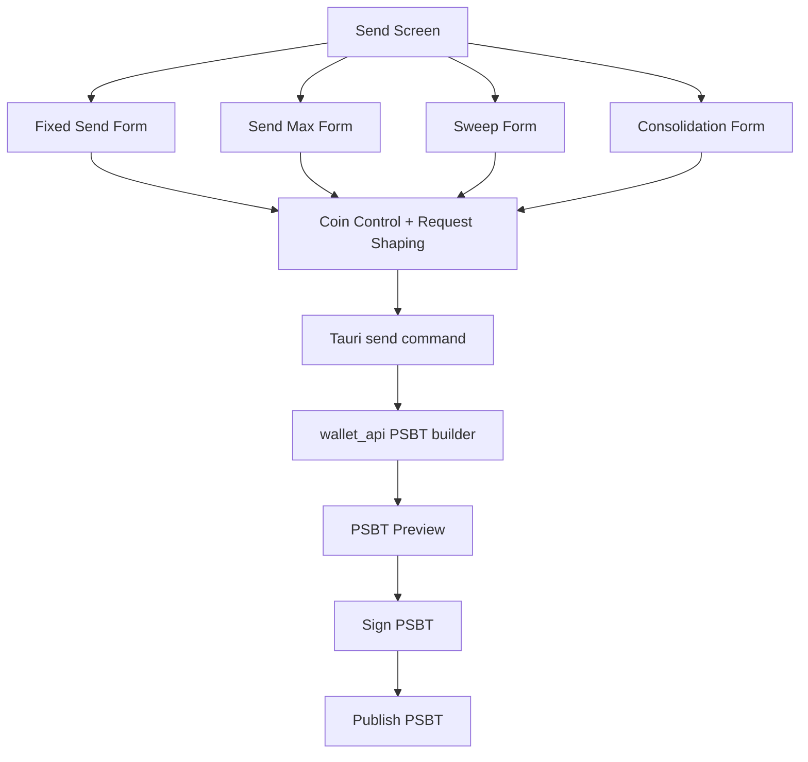
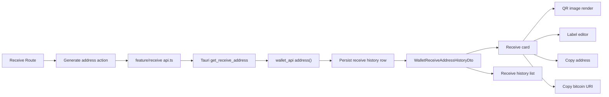
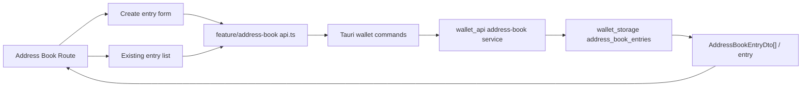

# Wallet Desktop Overview

`wallet_desktop` is the repository's first desktop user interface built on Tauri, React, and TypeScript.

The current implementation is not a wireframe anymore. It already drives real wallet flows through `wallet_api` and the same regtest-backed runtime used by the CLI.

## Role In The Repository

The desktop app is a presentation layer over the existing Rust wallet stack:

```text
React UI
  -> Tauri invoke
  -> Tauri Rust command modules
  -> wallet_api
  -> wallet_core / wallet_sync / wallet_storage
```

The desktop app does not implement wallet logic itself. It renders wallet state, collects user intent, and forwards requests to Rust.

## Implemented Product Surface

Current routed screens:

- Overview
- Receive
- Address Book
- UTXOs
- Send
- Transactions

Current desktop capabilities:

- load and switch wallets through a shared wallet provider
- show wallet status and backend health
- generate the next receive address for the active wallet
- list persisted receive-address history for the active wallet
- display receive-address keychain, derivation-index, timestamp, label, and QR metadata
- render a QR image for the active receive address
- copy the raw receive address and Bitcoin URI from a dedicated receive surface
- create, list, and delete wallet-scoped address-book entries for external recipients
- inspect UTXOs and carry selected outpoints into send flows
- lock and unlock UTXOs from the UTXO screen with persisted wallet-scoped lock reasons
- build PSBT previews for fixed send, send-max, sweep, and consolidation
- sign and publish PSBTs
- inspect transaction history with derived parent/child graph data
- classify transactions by user-visible intent and show intent badges in history/details
- create and broadcast RBF and CPFP flows from the Transactions screen

## Transaction Creation Flows

The current GUI does not only support a basic fixed-amount send path. Four transaction-building modes are implemented and all of them converge into the same PSBT lifecycle:



That shared downstream pipeline is the important product fact. The forms differ, but preview, signing, and publishing are intentionally unified.

## Receive Flow

Receive is now a dedicated first-class screen rather than an implicit wallet helper.



The receive page now does four real things in one surface: it generates the next wallet-controlled address, renders the backend-produced QR for the active address, lets the user edit the persisted label for that row, and lets the user browse the stored receive history.

## Address Book Flow

Address book is now a dedicated routed surface for external recipient management.



This flow is intentionally separate from receive history. Receive rows are wallet-owned derivations. Address-book rows are external destinations that the user curates.

## Transaction Intent Layer

The Transactions screen now exposes more than raw wallet history. The desktop client resolves a transaction intent for display:

- `fixed`
- `send_max`
- `sweep`
- `consolidation`
- `rbf`
- `cpfp`
- `unknown`

Intent resolution is hybrid:

- the Send screen stores explicit intent after publishing fixed/send-max/sweep/consolidation flows
- the Transactions screen stores explicit intent after broadcasting RBF and CPFP flows
- if no stored intent exists, the frontend falls back to structural inference from wallet-owned outputs and input/output shape

This is a desktop presentation feature. It improves operator understanding without changing Rust-side transaction semantics.

## What Is Actually Running

The frontend is under [src](/Users/alexandereygenson/MyRust/rust-descriptor-wallet/apps/wallet_desktop/src).

The Tauri host is under [src-tauri](/Users/alexandereygenson/MyRust/rust-descriptor-wallet/apps/wallet_desktop/src-tauri).

The Rust side initializes `WalletApi` once at app startup in [src-tauri/src/lib.rs](/Users/alexandereygenson/MyRust/rust-descriptor-wallet/apps/wallet_desktop/src-tauri/src/lib.rs) and exposes wallet, UTXO, transaction, send, RBF, and CPFP commands.

## Design Direction That Survived Contact With Code

Three earlier design ideas are now implemented and still correct:

- Rust remains the source of truth for transaction construction.
- The send experience is PSBT-preview-first.
- Coin control in the UI expresses user intent, while final selection stays backend-owned.
- locked UTXOs are enforced in Rust, not merely hidden in the table UI.

## Gaps And Near-Term Limits

The app is still a first version.

Notable current limits:

- no settings or wallet import management UI
- no query library; data loading is handled with local `useEffect`/`useState` patterns
- no generalized component library yet

## Summary

`wallet_desktop` has moved from design draft to a working first GUI over the real wallet runtime. The documentation for this app should now describe the implemented command surface and screens, not an aspirational future shell.
