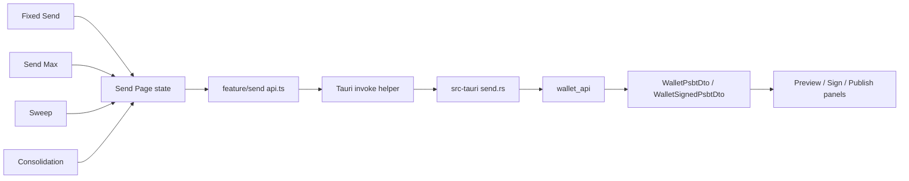

# UI Architecture

This document describes the implemented architecture of `wallet_desktop`, not a future idealized shell.

## Top-Level Structure

The app is split between:

- [apps/wallet_desktop/src](/Users/alexandereygenson/MyRust/rust-descriptor-wallet/apps/wallet_desktop/src) for the React frontend
- [apps/wallet_desktop/src-tauri](/Users/alexandereygenson/MyRust/rust-descriptor-wallet/apps/wallet_desktop/src-tauri) for the Rust/Tauri host

## Frontend Layout

The React tree is organized into:

```text
src/
  app/
    layout/
    providers/
    router/
  features/
    receive/
    wallet/
    utxos/
    send/
    transactions/
  pages/
  shared/
  styles/
```

This is now real structure, not just a proposed target.

## Routing

[src/app/router/routes.ts](/Users/alexandereygenson/MyRust/rust-descriptor-wallet/apps/wallet_desktop/src/app/router/routes.ts) defines five routes:

- `/`
- `/receive`
- `/utxos`
- `/send`
- `/transactions`

[src/app/router/AppRouter.tsx](/Users/alexandereygenson/MyRust/rust-descriptor-wallet/apps/wallet_desktop/src/app/router/AppRouter.tsx) mounts them under a shared shell.

## Application Shell

[src/app/layout/AppShell.tsx](/Users/alexandereygenson/MyRust/rust-descriptor-wallet/apps/wallet_desktop/src/app/layout/AppShell.tsx) provides the persistent frame:

- sidebar navigation
- top bar
- outlet for screen content

This means the current app already has a stable navigation skeleton rather than isolated pages.

## Wallet Context

[src/app/providers/WalletProvider.tsx](/Users/alexandereygenson/MyRust/rust-descriptor-wallet/apps/wallet_desktop/src/app/providers/WalletProvider.tsx) is the central app-level state provider.

It owns:

- loaded wallet list
- selected wallet name
- selected wallet summary
- refresh lifecycle
- wallet loading/error state

This is the one real global state boundary in the current app.

## Feature Boundaries

### Wallet

[src/features/wallet/api.ts](/Users/alexandereygenson/MyRust/rust-descriptor-wallet/apps/wallet_desktop/src/features/wallet/api.ts) wraps app-info, wallet listing, status, sync, and backend health commands.

### Receive

[src/features/receive](/Users/alexandereygenson/MyRust/rust-descriptor-wallet/apps/wallet_desktop/src/features/receive) owns:

- receive-address API wrapper
- receive-history API wrapper
- address formatting and Bitcoin-URI helpers
- generated-address card rendering
- receive-history list rendering
- empty-state rendering for no-wallet and no-address states

This feature is intentionally narrow. It is a direct frontend wrapper over wallet-controlled address generation and persisted receive history rather than a generalized address-book or request-management system.

The backend command surface already covers list, label, and clear-label operations. The current rendered page uses generation plus history browsing, while label-editing helpers exist in the feature module but are not yet mounted into the visible page flow.

### UTXOs

[src/features/utxos](/Users/alexandereygenson/MyRust/rust-descriptor-wallet/apps/wallet_desktop/src/features/utxos) owns:

- table rendering
- selection summary
- action bar
- UTXO summary cards
- selection helpers

This feature is also the handoff point into send flows. Selected outpoints are forwarded to the Send page through router state.

### Send

[src/features/send](/Users/alexandereygenson/MyRust/rust-descriptor-wallet/apps/wallet_desktop/src/features/send) is the largest feature area.

It owns:

- fixed send form
- send-max form
- sweep form
- consolidation form
- send mode selector
- coin control selector and summary
- PSBT preview panel
- frontend request-shaping helpers

The Send page is stateful and intentionally coordinates several modes without introducing a separate global store.

The implemented send architecture is multi-entry but single-pipeline:



This is why the diagrams should show send max, sweep, and consolidation explicitly. They are not side features outside the main transaction-creation path.

### Transactions

[src/features/transactions](/Users/alexandereygenson/MyRust/rust-descriptor-wallet/apps/wallet_desktop/src/features/transactions) owns:

- transaction list filters
- action menus
- transaction details modal
- transaction intent badge rendering
- RBF PSBT workflow panel
- CPFP PSBT workflow panel
- parent/child graph helpers

The graph helper layer is implemented and unit-tested in [graph.ts](/Users/alexandereygenson/MyRust/rust-descriptor-wallet/apps/wallet_desktop/src/features/transactions/graph.ts) and [graph.test.ts](/Users/alexandereygenson/MyRust/rust-descriptor-wallet/apps/wallet_desktop/src/features/transactions/graph.test.ts).

The Transactions feature now also owns a thin intent-resolution layer:

- explicit intent persistence in browser `localStorage`
- post-broadcast intent writes for send, RBF, and CPFP flows
- fallback inference for unlabeled transactions

That logic lives on the frontend because it is display-oriented metadata, not wallet-core transaction truth.

## Data Flow

The implemented data flow is:

```text
page component
  -> feature api wrapper
  -> shared invoke helper
  -> Tauri command
  -> wallet_api
```

There is no React Query or equivalent caching layer yet. The current app uses local `useEffect` + `useState` fetch cycles per page and refreshes after publish actions where needed.

That is acceptable for the current scope, but it is an explicit limitation of the first version.

## Tauri Boundary

[src/shared/lib/tauri.ts](/Users/alexandereygenson/MyRust/rust-descriptor-wallet/apps/wallet_desktop/src/shared/lib/tauri.ts) centralizes the invoke helper on the frontend.

Rust commands are grouped under:

- [src-tauri/src/commands/wallet.rs](/Users/alexandereygenson/MyRust/rust-descriptor-wallet/apps/wallet_desktop/src-tauri/src/commands/wallet.rs)
- [src-tauri/src/commands/utxos.rs](/Users/alexandereygenson/MyRust/rust-descriptor-wallet/apps/wallet_desktop/src-tauri/src/commands/utxos.rs)
- [src-tauri/src/commands/transactions.rs](/Users/alexandereygenson/MyRust/rust-descriptor-wallet/apps/wallet_desktop/src-tauri/src/commands/transactions.rs)
- [src-tauri/src/commands/send.rs](/Users/alexandereygenson/MyRust/rust-descriptor-wallet/apps/wallet_desktop/src-tauri/src/commands/send.rs)
- request DTO decoding in [src-tauri/src/commands/send_model.rs](/Users/alexandereygenson/MyRust/rust-descriptor-wallet/apps/wallet_desktop/src-tauri/src/commands/send_model.rs)

The receive flow lives in the wallet command module through `get_receive_address`, `list_receive_addresses`, `label_receive_address`, and `clear_receive_address_label`. Send-related Tauri commands now normalize frontend request objects into the canonical `wallet_api` request DTOs before calling into Rust service functions.

## Architectural Decisions Visible In Code

- wallet selection is application-level state
- UTXO selection is feature-local state
- send-mode coordination is page-local state
- transaction actions are transaction-page-local state
- final PSBT construction stays in Rust
- sign/publish still go through the API boundary instead of custom desktop-only logic

## Summary

The current desktop architecture is feature-based, backend-driven, and intentionally thin on domain logic. The main architectural truth is that `wallet_desktop` is already a real client of `wallet_api`, not a placeholder frontend scaffold anymore.
